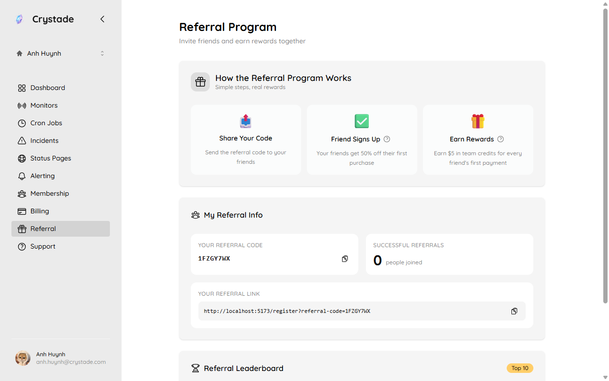

import { Steps, Aside, LinkCard, CardGrid } from '@astrojs/starlight/components';

The Affiliate Program pays a recurring cash commission on qualifying subscription payments from users you refer. Commissions accrue to you as a user, not to a team. Opt-in is auto-approved; tracking can start before payout identity is verified.

This program replaces the older credits-based referral program for new attributions. Existing v1 relationships stay on credits and a referee discount; they are not migrated to cash.

## Before you begin

- Sign in to Crystade.
- Read and accept the current Affiliate Terms when you opt in.
- Payouts are USD only. Transfer and FX fees are yours. You are responsible for taxes on commissions.

## Opt in and share your link

Open **Referral** in the sidebar (shown on your personal team).

<Steps>

1. Open **Referral** and opt in. Crystade records the terms version you accepted.

2. Copy your unique code and URL (`?referral-code=CODE`).

3. Share the link. A click sets a first-party cookie for 30 days (last click wins while the visitor is not registered). Attribution happens only at signup of a **new** user.

</Steps>

At signup, an explicit code in the request wins over the cookie. If the cookie expired and no code is present, there is no attribution. Clicking a link after signup does not create or change attribution. Self-referral is prohibited.

## How commission is calculated

Under Affiliate Terms v2:

| Field | Value |
|-------|--------|
| Rate | 30% |
| Duration | 12 months from the referred user's first qualifying payment |
| Cookie window | 30 days, last-click, first-party |
| Hold | 45 days from the payment before pending becomes approved |
| Payout threshold | $100 USD approved balance |
| Referee discount | None |

Commission uses the payment subtotal after discounts, excluding tax, in USD cents. Amounts funded by credits or auto-applied discounts contribute $0. The clock does not restart on renewals, upgrades, or new teams. Payments after the clock ends accrue $0.

Qualifying charges are base plans and addons on teams where the referred user is the billing admin, when that team's first successful payment is after attribution.

**Example:** A referred user pays Standard monthly at $49.00 with no discount. Commission is $14.70. Twelve unchanged monthly renewals accrue $176.40, each still subject to the 45-day hold. After month 12, further renewals accrue $0 for that user.

<Aside>
Refunds and chargebacks can void or reduce unpaid commission. Already-paid amounts can be set off against later approved commission. Crystade may withhold a payout for up to 90 days when fraud or terms issues are reasonably suspected.
</Aside>

## Request a payout

<Steps>

1. Wait until **approved** balance is at least $100. Pending, approved, and paid balances are shown separately.

2. Complete payout identity verification (manual review by Crystade). Tracking can proceed before this.

3. Request a payout. There is no automatic monthly disbursement. Crystade fulfills payouts manually.

</Steps>

The first successful payout waits until you have at least two distinct referred users with at least one qualifying payment each. You have exactly one verified payout identity; changing it requires re-verification.

The dashboard lists per-referral status without exposing the referred user's email or display name.

## Legacy referral rewards (v1)

Attributions created under the old program keep those terms: the referrer received $5 credits on their personal team at the referee's first Paddle payment, and the referee could receive a one-time 50% discount on the first billing period of their personal team (offer valid 60 days). New attributions after the affiliate launch use cash Terms v2 instead.

## Verify it worked

- Your dashboard shows a referral link and cookie window.
- A new signup that used your code appears as attributed (without PII).
- After a qualifying payment, a pending commission entry appears, then moves to approved after 45 days if it is not refunded.

## Related

<CardGrid>
<LinkCard title="Billing and plans" href="/guides/billing/" description="What counts as a qualifying plan or addon payment." />
<LinkCard title="Getting started" href="/guides/getting-started/" description="How new users sign up and create a personal team." />
</CardGrid>
