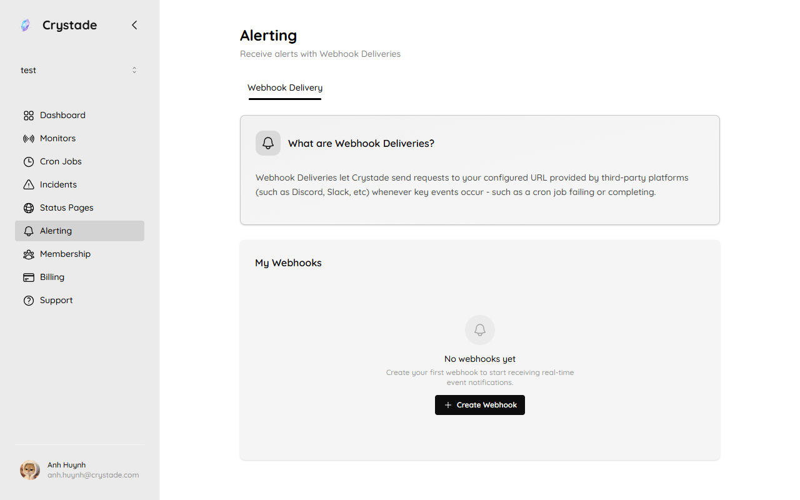
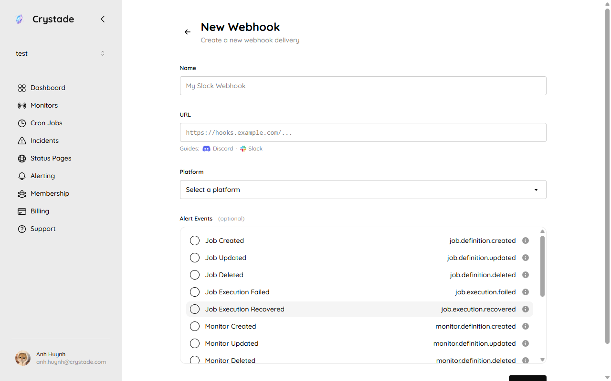

import { Steps, Aside, LinkCard, CardGrid } from '@astrojs/starlight/components';

Alert webhooks POST notifications to a Discord, Slack, Telegram, or Zalo URL when team events occur. A webhook channel is a team-scoped resource. Any owner can create, update, or delete it. Members cannot. You can disable a channel without deleting it.

Webhook channels are free to define. The number of non-deleted channels is plan-gated: Free 1, Starter 5, Standard 10. See [plan limits](/reference/plans/).

**TL;DR:** Create a destination URL on Discord, Slack, Telegram, or Zalo, paste it into **Alerting**, pick events, and save. Discord and Slack use an incoming webhook URL. Telegram and Zalo use a `sendMessage` URL that includes `chat_id`. Treat every URL as a secret.

## Before you begin

- You must be an owner of the team.
- Create a destination URL on Discord, Slack, Telegram, or Zalo using the platform sections below, then copy it.
- Crystade rejects private, loopback, and link-local URLs. The URL must use the official prefix for the platform you select:

| Platform | URL must start with | Example shape |
|----------|---------------------|---------------|
| Discord | `https://discord.com/api/webhooks/` | `https://discord.com/api/webhooks/<WEBHOOK_ID>/<WEBHOOK_TOKEN>` |
| Slack | `https://hooks.slack.com/services/` | `https://hooks.slack.com/services/<TEAM_ID>/<BOT_ID>/<TOKEN>` |
| Telegram | `https://api.telegram.org/bot` | `https://api.telegram.org/bot<BOT_TOKEN>/sendMessage?chat_id=<CHAT_ID>` |
| Zalo | `https://bot-api.zaloplatforms.com/bot` | `https://bot-api.zaloplatforms.com/bot<BOT_TOKEN>/sendMessage?chat_id=<CHAT_ID>` |

:::caution
Webhook URLs embed secrets (a webhook token, bot token, and for Telegram and Zalo a chat ID). Do not commit them, paste them in a public channel, or share them in screenshots.
:::

## Set up Discord

Discord incoming webhooks post messages to one text channel. You need the **Manage Webhooks** permission on that server. See Discord's [Intro to Webhooks](https://support.discord.com/hc/en-us/articles/228383668-Intro-to-Webhooks).

<Steps>

1. Open the Discord server, then **Server Settings** → **Integrations**.

2. Choose **Create Webhook** (or **Webhooks** → **New Webhook**).

3. Name the webhook, pick the text channel that should receive alerts, and save.

4. Copy the Webhook URL. It looks like `https://discord.com/api/webhooks/<WEBHOOK_ID>/<WEBHOOK_TOKEN>`.

</Steps>

## Set up Slack

Slack incoming webhooks post messages to the channel chosen when you install the app. See Slack's [incoming webhooks guide](https://docs.slack.dev/messaging/sending-messages-using-incoming-webhooks/).

<Steps>

1. [Create a Slack app](https://api.slack.com/apps?new_app=1) in the workspace that should receive alerts. You can reuse an existing app.

2. Open **Incoming Webhooks** and turn **Activate Incoming Webhooks** on.

3. Choose **Add New Webhook to Workspace**, pick the channel, and authorize. To post into a private channel, you must already be a member of that channel.

4. Copy the webhook URL under **Webhook URLs for Your Workspace**. It looks like `https://hooks.slack.com/services/<TEAM_ID>/<BOT_ID>/<TOKEN>`.

</Steps>

That URL is bound to the user who installed the app and to that channel. Slack searches for leaked webhook URLs and revokes them.

## Set up Telegram

Telegram alerts use [sendMessage](https://core.telegram.org/bots/api#sendmessage). Crystade needs a bot token and the chat ID of the conversation that should receive messages. Encode both in the URL.

### Create a Telegram bot

<Steps>

1. Open Telegram and message [@BotFather](https://t.me/BotFather).

2. Send `/newbot` and follow the prompts for a display name and a username.

3. Copy the bot token BotFather returns. It looks like `123456789:AAExampleToken`.

</Steps>

### Get the Telegram chat ID

You must start a conversation with the bot before Telegram returns a chat ID.

<Steps>

1. Open your bot in Telegram and tap **Start**, or send it any message.

2. Request recent updates. In a browser or with `curl`, call:

   ```bash
   curl "https://api.telegram.org/bot<BOT_TOKEN>/getUpdates"
   ```

3. Read `result[].message.chat.id`. In a private chat this is your user ID.

</Steps>

A redacted `getUpdates` response looks like this. Use the value of `chat.id` as `<CHAT_ID>`:

```json
{
  "ok": true,
  "result": [
    {
      "update_id": 123456789,
      "message": {
        "message_id": 1,
        "from": {
          "id": 100000000,
          "is_bot": false,
          "first_name": "Ada"
        },
        "chat": {
          "id": 100000000,
          "first_name": "Ada",
          "type": "private"
        },
        "date": 1749632637,
        "text": "hello"
      }
    }
  ]
}
```

### Build the Telegram URL

Paste this into Crystade, with your token and chat ID:

```text
https://api.telegram.org/bot<BOT_TOKEN>/sendMessage?chat_id=<CHAT_ID>
```

If `getUpdates` returns an empty `result` array, message the bot again and retry. Confirm you replaced `<BOT_TOKEN>` in the `getUpdates` URL.

## Set up Zalo

Zalo alerts use [sendMessage](https://docs.zaloplatforms.com/docs/BOT/apis/sendMessage). Crystade needs a bot token and the chat ID of the person who messaged the bot. Encode both in the URL. Creating the bot follows Zalo's [create a bot](https://docs.zaloplatforms.com/docs/BOT/create_bot) flow.

### Create a Zalo bot

<Steps>

1. Open the Zalo app and search for the official account **Zalo Bot Manager**.

2. In that chat, choose **Create bot** to open Zalo Bot Creator.

3. Enter a bot name that starts with `Bot ` (for example `Bot Alerts`) and the other required fields, then confirm.

4. Copy the **Bot Token** Zalo sends to your account in a message.

</Steps>

### Get the Zalo chat ID

Zalo does not show the chat ID in the creator UI. Capture it from an inbound message, either with Zalo [`getUpdates`](https://docs.zaloplatforms.com/docs/BOT/apis/getUpdates) or with an HTTPS request inspector. `getUpdates` does not return messages while a webhook is configured; delete the webhook first if you use that API.

<Steps>

1. Create a temporary HTTPS endpoint in a request inspector such as [Hookdeck](https://console.hookdeck.com/), and copy that URL.

2. In Zalo Bot Creator, set the bot webhook URL to the inspector URL.

3. Send any message to your bot from the Zalo account that should receive alerts.

4. Open the captured JSON and copy `message.chat.id` (you can also use `message.from.id` in a private chat).

</Steps>

A redacted inbound payload looks like this. Use the value of `message.chat.id` as `<CHAT_ID>`:

```json
{
  "event_name": "message.text.received",
  "message": {
    "date": 1749632637199,
    "chat": {
      "chat_type": "PRIVATE",
      "id": "<CHAT_ID>"
    },
    "message_id": "82599fa32f56d00e8941",
    "from": {
      "id": "<CHAT_ID>",
      "is_bot": false,
      "display_name": "Ada Lovelace"
    },
    "text": "hello"
  }
}
```

Remove the inspector webhook from the bot after you have the chat ID. Crystade delivers outbound `sendMessage` calls; it does not need Zalo's inbound webhook.

### Build the Zalo URL

Paste this into Crystade, with your token and chat ID:

```text
https://bot-api.zaloplatforms.com/bot<BOT_TOKEN>/sendMessage?chat_id=<CHAT_ID>
```

## Create a webhook channel

Open **Alerting** in the sidebar. Webhook deliveries live under **Webhook Delivery**.



<Steps>

1. Open **Alerting** for the team.

2. Choose **Create Webhook**, name the channel, and pick **Discord**, **Slack**, **Telegram**, or **Zalo**.

   

3. Paste the destination URL from the matching platform section. Private, loopback, and link-local URLs are rejected.

4. Select the events this channel should receive. An empty selection is allowed; the channel then delivers nothing until you add events.

5. Save. The channel is enabled unless you disable it later.

</Steps>

## Events you can subscribe to

| Event | When it fires |
|-------|----------------|
| Cron job created, updated, or removed | An owner or member changes a cron job definition |
| `job.execution.succeeded` | A cron execution completed successfully and the previous run was not a failure |
| `job.execution.failed` | A cron execution failed |
| `job.execution.recovered` | A cron execution succeeded after the previous run failed |
| Monitor created, updated, or removed | A monitor definition changes |
| `monitor.check.succeeded` | A monitor check succeeded and the previous check was not a failure |
| `monitor.check.failed` | A monitor check failed |
| `monitor.check.recovered` | A monitor check succeeded after a previous failure |
| Incident created or updated | A new incident is reported or an existing incident changes |
| Status page created, updated, or removed | Status page configuration changes |
| Status page subscriber added or removed | Someone subscribes or unsubscribes |

Cron execution alerts include job identity, execution status, HTTP status when present, error details, start and end time, and attempt count. Monitor check alerts include monitor identity, location, success flag, and scheduled time.

<Aside>
Delivery is best-effort. A disabled channel does not receive events. Attaching webhooks to some resources may be billed with that resource; channel definitions themselves are not billed.
</Aside>

## Disable or delete a channel

Owners can disable a channel so it stays configured but stops delivering. Owners can also delete a channel, which counts against the non-deleted channel limit.

## Verify it worked

- Send a test by triggering a subscribed event, for example a manual cron run that fails or succeeds.
- Confirm Discord or Slack posts in the chosen channel, or that Telegram or Zalo delivers a message in the chat whose ID you used.
- Disable the webhook and trigger again; no new message should appear.

## Troubleshooting

| Symptom | What to check |
|---------|----------------|
| Cannot create a channel | Only owners can create webhook channels. Check the plan channel limit. |
| URL rejected | Use the official prefix for the selected platform. Telegram and Zalo URLs must include `/sendMessage?chat_id=`. Private destinations are blocked. |
| Telegram or Zalo: no messages | Message the bot at least once (Telegram: tap **Start**). Confirm `<CHAT_ID>` is the `chat.id` from an inbound payload, and that `<BOT_TOKEN>` is complete. |
| Zalo: URL accepted but silent | Confirm the token is the Bot Token Zalo messaged you, not the inspector URL, and that `chat_id` is the user who messaged the bot. |
| No messages | Confirm the channel is enabled and subscribed to the event that fired. |

## FAQ

### Can I use Telegram or Zalo on a free plan?

Yes. Platforms are not plan-gated. The free plan allows 1 non-deleted webhook channel. Starter allows 5. Standard allows 10. See [plan limits](/reference/plans/).

### Why do Telegram and Zalo URLs need `chat_id`?

Discord and Slack bind the destination when you create the incoming webhook. Telegram [sendMessage](https://core.telegram.org/bots/api#sendmessage) and Zalo [sendMessage](https://docs.zaloplatforms.com/docs/BOT/apis/sendMessage) require `chat_id` on every call, so you put it in the query string.

### Why was my URL rejected?

The URL must use the official prefix for the platform you selected, and it must not point at a private, loopback, or link-local address. For Telegram and Zalo, include `sendMessage` and `chat_id` as shown in the platform sections.

## Related

<CardGrid>
<LinkCard title="Create and run a cron job" href="/guides/cron-jobs/" description="Executions that can succeed, fail, or recover." />
<LinkCard title="Create an availability monitor" href="/guides/monitors/" description="Checks that can fail or recover." />
<LinkCard title="Report and update incidents" href="/guides/incidents/" description="Incident events you can send to a webhook channel." />
</CardGrid>
