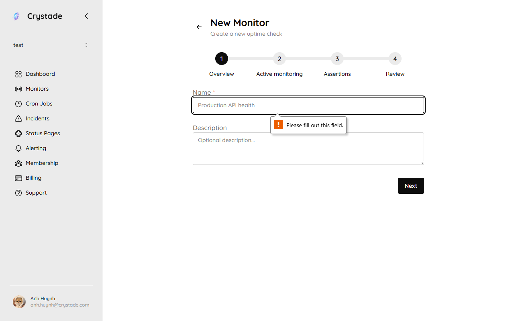

import { Steps, Aside, LinkCard, CardGrid } from '@astrojs/starlight/components';

An assertion is a team-scoped evaluation linked to a monitor. Each time a check log arrives, linked assertions run and record an assertion run as healthy or failure. Failure includes a clear error message.

Use assertions to decide when a probe result should open or close an [incident](/guides/incidents/). Do not use this page for Check Script (DSL); that is a separate Starter and Standard feature on the monitor itself.

## Before you begin

- Create a [monitor](/guides/monitors/).
- Plan caps apply: assertions per team (10 / 20 / 50) and assertions linked per monitor (1 / 3 / 5). See [plan limits](/reference/plans/).

## Link an assertion

When you create a monitor, the wizard includes an **Assertions** step after **Active monitoring**. You can also link an assertion later from the monitor.

<Steps>

1. Open the monitor and choose **Link assertion**, or create an assertion in the team's assertion library first. On create, complete the **Assertions** step in the **New Monitor** wizard.

2. Set hysteresis, or keep the defaults:
   - `failure_count` = 3
   - `window_size` = 5
   - `recovery_streak` = 5

3. Save. Changes to the monitor apply to every linked monitor–assertion pair.

</Steps>

Hysteresis parameters must satisfy `1 <= failure_count <= recovery_streak <= window_size <= 10`. Opening an incident is easier than resolving it: recovery requires a consecutive success streak, not merely fewer failures in the window.

## How incidents open and close

For each monitor–assertion pair:

- An incident opens when the assertion run state swaps from healthy to failure, after the failure pattern meets hysteresis.
- That incident closes when the state swaps from failure to healthy, after the recovery streak.
- At most one incident is open at a time for that pair. If an incident is already open, Crystade does not open another.
- If an incident is already open and the latest response is `investigating`, a new incident response is inserted only when the rendered content is different.

## Verify it worked

- Trigger a failing check (or wait for one). After `failure_count` failures in `window_size` checks, an incident appears.
- Restore the target. After `recovery_streak` consecutive successes, the incident resolves.
- Confirm only one open incident exists for that monitor–assertion pair.

<Aside>
The first-win onboarding path requires at least one linked assertion so you can see assertion-run pass/fail next to the probe outcome.
</Aside>

## Troubleshooting

| Symptom | What to check |
|---------|----------------|
| Cannot link another assertion | You hit the per-monitor or per-team cap for your plan. |
| Incident opened too quickly | Raise `failure_count` or `window_size`. |
| Incident never resolves | Recovery requires `recovery_streak` consecutive successes, which must be greater than or equal to `failure_count`. |

## Related

<CardGrid>
<LinkCard title="How monitoring relates to incidents" href="/concepts/monitoring-incidents-status/" description="Why hysteresis exists and when to use a manual incident." />
<LinkCard title="Report and update incidents" href="/guides/incidents/" description="Severity, responses, and publish." />
<LinkCard title="Create an availability monitor" href="/guides/monitors/" description="Protocols, intervals, and check logs." />
</CardGrid>
