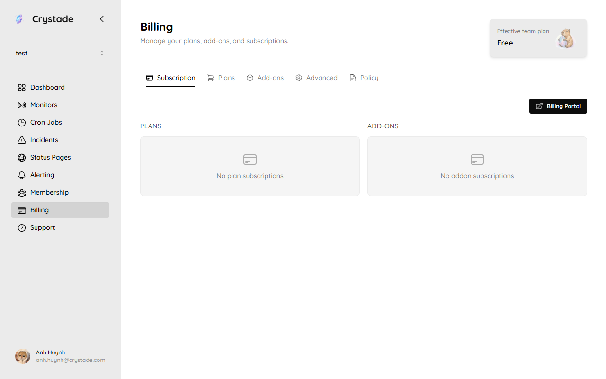

import { Aside, CardGrid, LinkCard } from '@astrojs/starlight/components';

Crystade billing is scoped to a team. Each team has its own plan, addons, invoices, and billing admin.

Payments, invoices, taxes, and payment method updates are handled by Paddle. Currency is USD.

## Plans

| Plan | Price | Best for |
|------|-------|----------|
| **Free** | $0 | Solo developers, side projects, and early prototypes |
| **Starter** | $15/month | Small teams launching production workloads |
| **Standard** | $49/month | Growing teams with more resources and owners |

A newly created team starts on Free. Resource-specific limits live in the [plan limits reference](/reference/plans/). Open **Billing** in the sidebar to see the current plan, addons, and payment actions.

## Seats and owners

| Feature | Free | Starter | Standard |
|---------|:----:|:-------:|:--------:|
| Team members | Unlimited | Unlimited | Unlimited |
| Owners | 1 | 2 | Unlimited |

## Addons

Addons let you increase capacity for a specific resource without changing your base plan. For example, a team may add more cron job capacity while staying on Free.

- Available on all plans, including Free
- Billed monthly
- Managed by the team's billing admin
- Scoped to the team that purchased them

Addon packs and prices are listed in the [plan limits reference](/reference/plans/).

## Plan and addon changes

| Change | When it takes effect |
|--------|----------------------|
| Upgrade plan | After successful payment |
| Increase addon quantity | After successful payment |
| Downgrade plan | At the next billing date |
| Decrease addon quantity | At the next billing date |
| Cancel paid subscription | At the end of the current paid period |

Upgrades and addon increases are billed immediately (prorated for the rest of the current period) and take effect only after Paddle confirms payment. Downgrades and addon decreases incur no proration.

During a pending downgrade, you can switch to any plan that does not exceed the original plan without being prorated. Switching above the original plan is an upgrade and is billed immediately. The same rule applies to pending addon decreases.

<Aside type="tip">
Crystade does not delete resources or execution history when billing changes. If a lower plan or addon quantity reduces capacity, surplus resources are [paused](/concepts/capacity/) until capacity is available again.
</Aside>

If a scheduled change leaves the team with no remaining paid items, the paid subscription ends and the team continues on Free.

## Billing admin

Every team has exactly one billing admin, who must be an owner. The team creator is the initial billing admin.

Only the current billing admin can:

- Start paid checkout
- Change the base plan or addon quantity
- Open the Paddle billing portal
- Stop renewal
- Transfer billing admin to another owner
- Exchange credits into a checkout discount

Members and other owners can view the current plan, limits, and billing warnings.

When you transfer billing admin, Crystade cancels the team's active subscriptions starting from the next billing period. The new billing admin must resubscribe if the team should keep paid entitlements. The current billing admin cannot leave, be removed, or be demoted until they transfer the role.

If the current billing admin is uncontactable, owners must reach Crystade support for a manual transfer.

## Past-due payments

If Paddle marks a subscription as past due, the team keeps its current paid entitlements during payment recovery. The billing admin sees a billing warning and links to recover payment.

While a subscription is past due, new paid upgrades and addon increases are blocked until the account returns to good standing. If Paddle recovers payment, the subscription returns to active without losing entitlements. If recovery fails and the paid term ends, the team falls back to the entitlements of any remaining paid items.

## Invoices and payment methods

The billing admin can open the Paddle customer portal to:

- Update payment methods
- View invoices and receipts
- Manage billing details
- Stop future renewal

Taxes are handled by Paddle. Billing documents are scoped to the team through the billing admin's Paddle customer.

## Money-back guarantee

Paid plans and addons include a 30-day money-back guarantee from the date of the **initial purchase**. The guarantee applies to the first purchase of a plan or addon only, not to renewals.

Contact Crystade support to request a refund within the guarantee window. Refunds outside that window are not self-serve.

## Credits and discounts

Credits belong to the team, do not expire, and cannot move to another team. Newly created teams start with no credits.

The billing admin can exchange credits into a one-time checkout discount at a rate of 1 credit = 1 USD. That discount expires 30 days after the exchange and cannot be converted back into credits. Credits are not cash.

When a checkout opens, Crystade pre-selects the team's active auto-applied discount if one exists. The billing admin can replace it with a different discount code during checkout.

## FAQ

### Who can change the plan?

Only the billing admin can start checkout, change the plan, or change addon quantity.

### What happens if I transfer billing admin?

Paid subscriptions for that team are cancelled from the next billing period. The new billing admin resubscribes to keep paid entitlements.

### Do I keep access while payment recovery is running?

Yes. The team keeps current paid entitlements while the subscription is past due. Upgrades and addon increases stay blocked until payment succeeds.

## Related

<CardGrid>
<LinkCard title="Teams and members" href="/guides/teams/" description="Understand the billing admin role and team ownership." />
<LinkCard title="How capacity pauses work" href="/concepts/capacity/" description="What happens when usage exceeds plan and addon limits." />
<LinkCard title="Plan limits" href="/reference/plans/" description="Limits, addon packs, and prices for each plan." />
</CardGrid>
