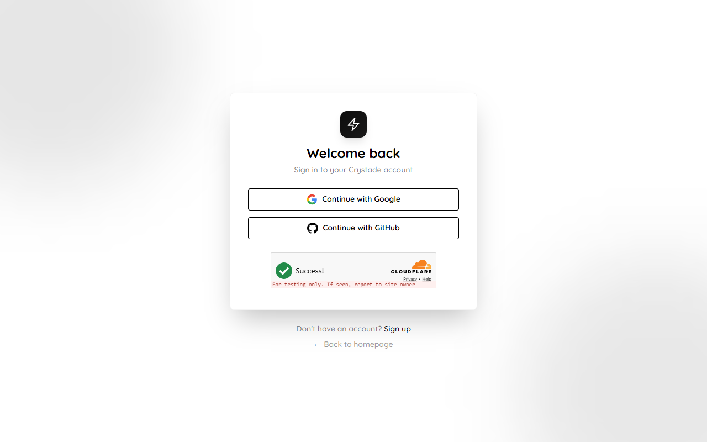
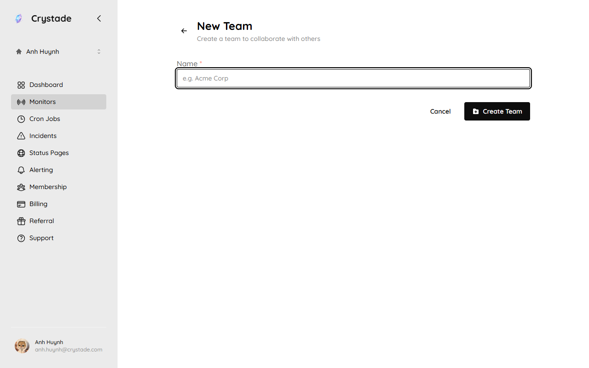

import { Steps, Aside, LinkCard, CardGrid } from '@astrojs/starlight/components';

Crystade creates a personal team for you when you sign in. You finish a short onboarding flow on that team, then you can invite teammates on a collaborative team when you need shared access.

## Sign in

You create an account with Google or GitHub. Crystade does not support password sign-in.

<Steps>

1. **Sign in** with Google or GitHub.

   

2. **Open your personal team.** Crystade creates this team automatically. Use it for solo work, experiments, or private resources. Switch teams from the name at the top of the sidebar.

   

3. **Complete onboarding.** New accounts answer a required survey, then create a real monitor or cron job on the personal team. Crystade runs that resource immediately so you see a result without waiting for the next schedule interval.

</Steps>

<Aside>
Your personal team is exclusive to you. Membership cannot be changed. If you need collaboration, create a separate collaborative team and invite members.
</Aside>

Invited members who join an existing team do not go through onboarding. Accounts that already existed when onboarding shipped are not prompted again.

## Work with a team

Collaborative teams keep resources, member access, and billing grouped together.

<Steps>

1. **Create a team** from the team switcher (**Create a new team**). You become the owner and billing admin.

   

2. **Invite teammates** by email from **Membership**. Invites expire after 24 hours.

3. **Assign roles** so trusted teammates can help manage the team.

</Steps>

You can create at most 5 teams. You can join at most 30 teams that you did not create. There is no limit on how many members a team can have.

## What to read next

<CardGrid>
<LinkCard title="Create your first monitor" href="/tutorials/first-monitor/" description="Probe an HTTP endpoint and see a check result." />
<LinkCard title="Create your first cron job" href="/tutorials/first-cron-job/" description="Schedule an HTTP request and read the first execution log." />
<LinkCard title="Teams and members" href="/guides/teams/" description="Learn how roles, invitations, and billing admin work." />
<LinkCard title="Billing and plans" href="/guides/billing/" description="Pick a plan and understand billing basics." />
</CardGrid>
