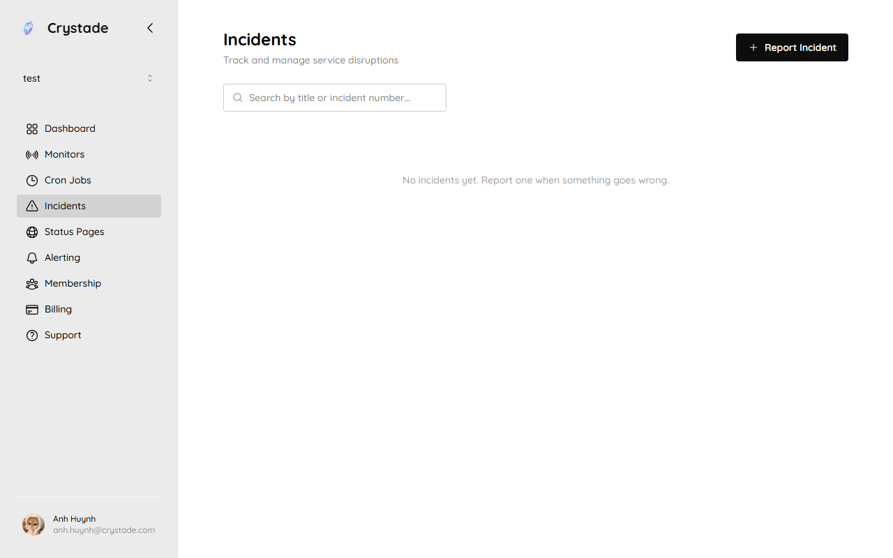
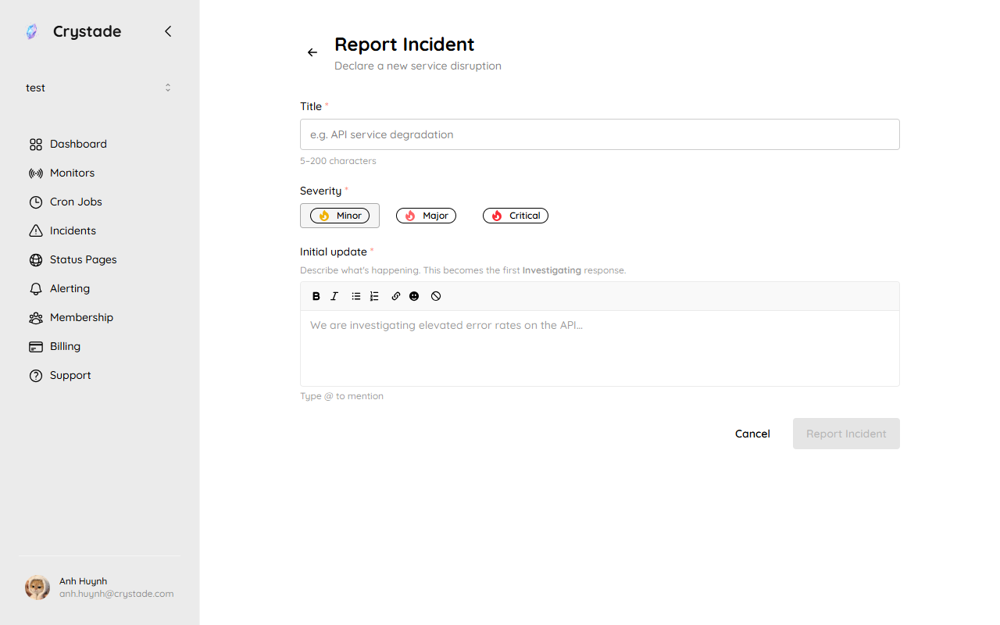

import { Steps, Aside, LinkCard, CardGrid } from '@astrojs/starlight/components';

An incident is a team-scoped disruption record. Members **report** incidents; they do not create, trigger, or delete them. Incidents are not deletable. Status is derived from the latest response.

Crystade reports some incidents from monitoring after assertion hysteresis. Members can also report incidents that probes cannot see.

## Before you begin

- Any member can report a manual incident and add responses.
- Only owners can publish or unpublish an incident.
- Free response length is 2000 characters; Starter and Standard allow 10000. System-generated responses are not limited by that cap.

## Report a manual incident

Open **Incidents** to see reported disruptions. Use **Report Incident**.

<Steps>

1. Open **Incidents** and choose **Report Incident**.

   

2. Set a **title** (5 to 200 characters) and **severity**: `minor`, `major`, or `critical`.

3. Write the first response. The first response must be type `investigating`. That response cannot be deleted. For a manual incident, the reporter is the author of this first response.

4. Save. The incident receives a team-scoped incident number starting at 1, and an incident ID.

</Steps>

Monitor-reported incidents get a system-generated first response that includes monitor name, failure reason, and check locations. You cannot mutate system-generated responses.

## Add responses

Responses form a chronological stack (newest on top). Each response has content, type, and timestamp. Content is written in a sanitized WYSIWYG editor.

Forward-only types:

`investigating` → `identified` → `monitoring` → `resolved` → `postmortem`

You may skip `identified` and `monitoring`. `postmortem` requires a prior `resolved` response. You can add responses after the incident is resolved.

The incident **status** is always the type of the latest (topmost) response. Title, severity, and publish state can change at any time.

Only the original author of a response may update or delete it. You cannot delete the first (bottommost) response. Response content and type are versioned; versions are not independently deletable.

## Publish an incident

Owners publish or unpublish an incident. Unpublished incidents stay inside the team. A [status page](/guides/status-pages/) displays only published incidents that are linked to that page.

<Aside type="caution">
Publishing notifies status-page subscribers. Unpublishing hides the incident from the public page; it does not delete the incident.
</Aside>

## Verify it worked

- The incident appears in the team's incident list with a number and derived status.
- Adding a `resolved` response changes the incident status to resolved.
- After an owner publishes, the incident is eligible to appear on linked status pages.

## Troubleshooting

| Symptom | What to check |
|---------|----------------|
| Cannot delete the incident | Incidents are not deletable. Resolve it and, if needed, unpublish it. |
| Cannot edit a response | Only the original author can update or delete a response. System-generated responses cannot be mutated. |
| Cannot add postmortem | Add a `resolved` response first. |
| Status page still empty | The incident must be published, and the status page must be allowed to show that incident. |

## Related

<CardGrid>
<LinkCard title="Configure assertions" href="/guides/assertions/" description="How monitor-reported incidents open and close." />
<LinkCard title="Publish a status page" href="/guides/status-pages/" description="Show published incidents to customers." />
<LinkCard title="How monitoring relates to incidents" href="/concepts/monitoring-incidents-status/" description="When to use automatic versus manual reports." />
</CardGrid>
