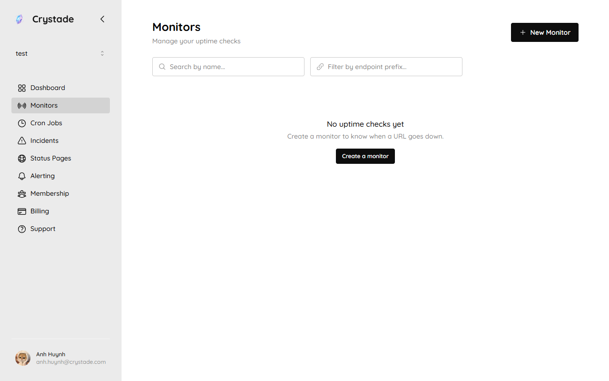
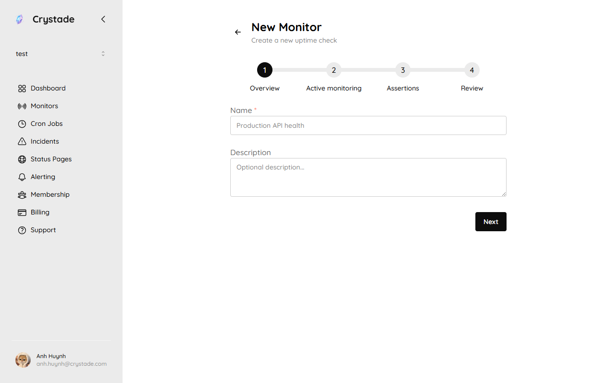

import { Steps, Aside, Tabs, TabItem, LinkCard, CardGrid } from '@astrojs/starlight/components';

A monitor is a team-scoped active probe. Crystade checks your target from multiple geographic locations on an interval you choose. Any member can create, update, or delete a monitor.

Protocol fields, error codes, and timing metrics are in the [monitor protocol reference](/reference/monitor-protocols/). Limits are in [plan limits](/reference/plans/).

## Before you begin

- Select the team that should own the monitor. Monitors cannot move to another team.
- Use a public target. Private, loopback, and link-local destinations are rejected.

## Choose interval and locations

Allowed intervals are 15 seconds, 30 seconds, 1 minute, 3 minutes, 5 minutes, 15 minutes, 30 minutes, 6 hours, 12 hours, and 24 hours. The plan minimum still applies: Free 5 minutes, Starter 1 minute, Standard 30 seconds.

Active monitoring runs from multiple locations at once. Supported regions are `europe-north1`, `us-west1`, `asia-southeast1`, and `australia-southeast1`. How many locations you can use is plan-gated (3 / 8 / 16).

The interval is a best-effort SLA. Execution can vary under high load. Schedule lag is kept under 5 seconds under normal load. Connection timeout is at most 5 minutes. A definition update takes effect within 5 minutes.

## Create a monitor

Open **Monitors** to list uptime checks. Use **New Monitor** or **Create a monitor**.

<Tabs>
<TabItem label="HTTP">

HTTP options include URL, request headers (max 20), request body (max 64 KB; plain text, JSON, or XML), redirect-follow limit (max 10), and connection timeout. HTTP/1.0, HTTP/1.1, and HTTP/2.0 are supported.

<Steps>

1. Open **Monitors** and choose **Create a monitor** (or **New Monitor**).

   

2. Set name, description, interval, and locations.

3. Choose **HTTP** and paste the URL.

4. Optionally set method, headers, body, redirects, and timeout.

5. Save, then [link an assertion](/guides/assertions/).

</Steps>

</TabItem>
<TabItem label="TCP">

TCP options are host, port, and connection timeout. Results include time to DNS resolved (TTDR), time to first byte (TTFB), round-trip time (RTT), error code, and error message.

<Steps>

1. Create a monitor and choose **TCP**.

2. Set host and port (for example `db.example.com` and `5432`).

3. Set timeout and locations, then save.

</Steps>

</TabItem>
<TabItem label="TLS">

TLS certificate checks require Starter or Standard. Options are host, port, and connection timeout. TLS 1.2 and TLS 1.3 are supported. Results include the verified certificate chain, overall status, TTDR, TTFB, RTT, and TLS-specific errors.

<Steps>

1. Create a monitor and choose **TLS**.

2. Set host and port (usually `443`).

3. After a check, inspect certificate subject, issuer, expiry, DNS names, and status.

</Steps>

</TabItem>
<TabItem label="Minecraft">

Minecraft options are host, port, connection timeout, and protocol version. Results include version, MOTD, player count, max players, TTDR, TTFB, RTT, and handshake errors.

<Steps>

1. Create a monitor and choose **Minecraft**.

2. Set host, port (often `25565`), and protocol version.

3. Save and confirm MOTD and player counts in the check log.

</Steps>

</TabItem>
</Tabs>

UDP monitoring is not available.

## Read a check log

Each check log is immutable. It stores the monitor snapshot, probe location, per-protocol request and response snapshots, and timing breakdown.

All check logs are retained regardless of plan. How far back you can view them is plan-gated (30 / 90 / 365 days). Free does not capture HTTP response bodies; Starter captures up to 4 KB; Standard up to 16 KB. Upstream responses are capped at 32 MB.

## Verify it worked

- The monitor appears in the team's monitor list.
- Check logs arrive from the locations you selected.
- Timing fields (TTDR, TTFB, RTT) are populated on successful connects.
- Linked assertions produce healthy or failure runs. See [Configure assertions](/guides/assertions/).

## Troubleshooting

| Symptom | What to check |
|---------|----------------|
| No checks yet | Wait up to 5 minutes after create or update. Confirm the monitor is not disabled or [paused](/concepts/capacity/). |
| Interval rejected | Free cannot go faster than 5 minutes; Starter 1 minute; Standard 30 seconds. |
| TLS option missing | TLS checks require Starter or Standard. |
| Target rejected | Probes cannot target private, loopback, or link-local addresses. Use a publicly reachable host and port. |

## Related

<CardGrid>
<LinkCard title="Create your first monitor" href="/tutorials/first-monitor/" description="HTTP first-win walkthrough on your personal team." />
<LinkCard title="Configure assertions" href="/guides/assertions/" description="Decide when a check is a failure and when an incident opens." />
<LinkCard title="Monitor protocols" href="/reference/monitor-protocols/" description="Options, timing metrics, and error codes per protocol." />
<LinkCard title="How monitoring relates to incidents" href="/concepts/monitoring-incidents-status/" description="The path from a probe to a public status update." />
</CardGrid>
