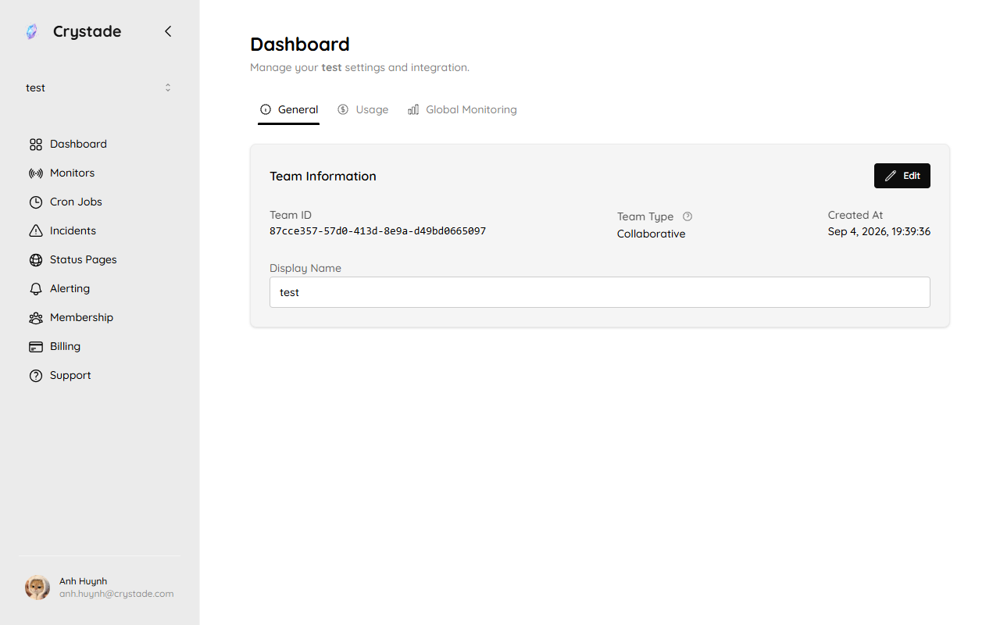

import { Aside, Card, CardGrid, LinkCard } from '@astrojs/starlight/components';

A resource is something your team manages in Crystade, such as a cron job, monitor, alert webhook, or status page.

Resources belong to a single team. This keeps access, billing, and history clear for everyone using that team.

## Team-scoped resources

When you create a resource, it is attached to the currently selected team. The **Dashboard** shows that team's information; cron jobs, monitors, and other resources live in their own sidebar pages.

This means:

- Team members with access can work with that team's resources
- Billing capacity applies to resources in that team
- Resources cannot be shared or moved across teams
- Resources and history stay organized by team

<Aside>
Create separate teams if different projects need separate access control, billing ownership, or operational visibility.
</Aside>

## Delete is permanent

Resources support delete from the product, not a restore flow. After you delete a resource, the deletion takes permanent effect. You cannot move a deleted resource to another team.

## Capacity

Your team's plan and addons determine how many resources you can run. Capacity is calculated per resource type.

For example:

- A base plan includes a number of cron jobs and monitors
- An addon may increase capacity for one resource type without changing the base plan
- Other resource types have their own limits and addons

See the [plan limits reference](/reference/plans/) for current numbers, and [How capacity pauses work](/concepts/capacity/) for how surplus resources are selected.

## What happens when capacity changes?

If your team downgrades a plan or removes an addon, capacity may become lower than your current usage.

Crystade preserves your resources and history. Resources above the new capacity are paused until capacity is available again.

Paused resources:

- Keep their configuration
- Keep their history
- Do not run while paused
- Still occupy entitlement slots
- Can resume when capacity increases again

A team cannot create new resources of that type while total countable resources are at or above capacity. Disabling a resource or leaving it paused does not free a slot. Only delete frees a slot for a new create.

<Aside type="tip">
To free capacity immediately, delete resources you no longer need or increase capacity through your plan or addons.
</Aside>

## Good practices

<CardGrid>
<Card title="Name resources clearly" icon="pencil">
	Use names that identify the service, environment, and purpose of each cron job or monitor.
</Card>
<Card title="Separate environments" icon="setting">
	Keep production and staging resources separate when they have different owners or billing needs.
</Card>
<Card title="Review unused resources" icon="magnifier">
	Remove resources that are no longer needed to keep capacity and dashboards clean.
</Card>
</CardGrid>

## Related

<CardGrid>
<LinkCard title="Billing and plans" href="/guides/billing/" description="Learn how plans and addons affect resource capacity." />
<LinkCard title="How capacity pauses work" href="/concepts/capacity/" description="How Crystade chooses which resources to pause and restore." />
<LinkCard title="Plan limits" href="/reference/plans/" description="Per-plan limits for each resource type." />
</CardGrid>
