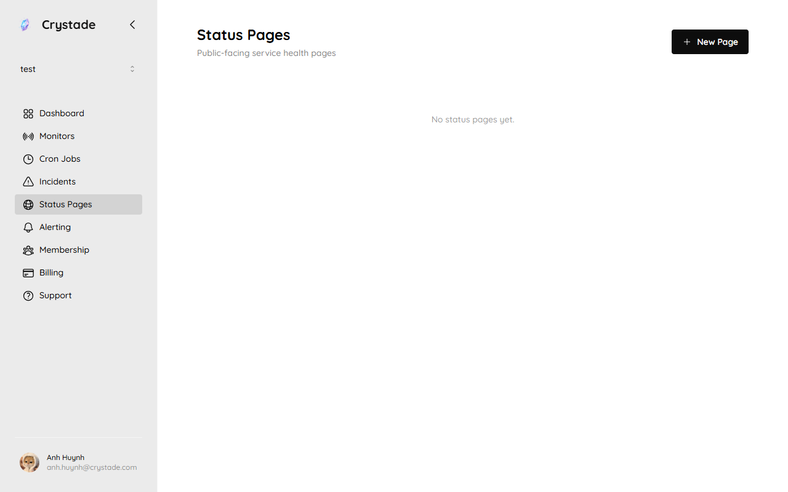
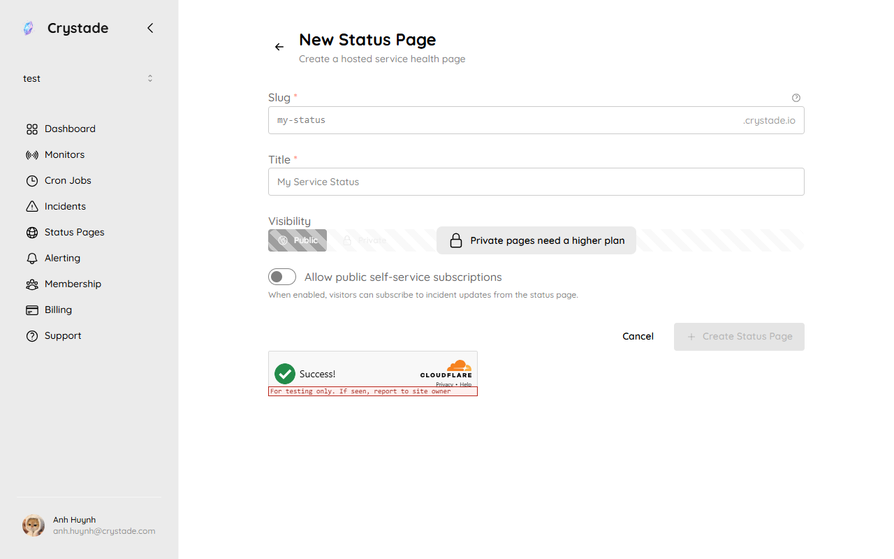

import { Steps, Aside, LinkCard, CardGrid } from '@astrojs/starlight/components';

A status page is a hosted page for service health, published incidents, and historical uptime. Each page has a unique slug and is available at `{slug}.crystade.io` with TLS included. Only owners can create, update, or delete status pages. Members cannot view status-page configuration.

## Before you begin

- You must be an owner.
- Plan caps apply to pages per team, monitors per page, and subscribers per page. See [plan limits](/reference/plans/).
- Incidents appear only when they are **published**. Unpublished incidents stay internal.

## Create a status page

Open **Status Pages** to list hosted pages. Use **New Page**.

<Steps>

1. Open **Status Pages** and choose **New Page**.

   

2. Set a **title** and a **slug**. The slug must be 4–16 characters, lowercase letters `a-z`, digits `0-9`, and hyphens. It must not start or end with a hyphen. Slugs are stored lowercase; `My-Page` is the same as `my-page`.

3. Optionally upload a square favicon (max 256×256, 1:1) and a banner (max 1920×640, 3:1).

4. Set the page to **public** (anyone) or **private** (authenticated team members only). Private pages require Starter or Standard.

5. Link monitors whose uptime should appear. Layout is fixed by Crystade; you cannot customize section order.

6. Save. The page is at `https://<slug>.crystade.io`. Updates appear on a best-effort basis with a maximum lag of 5 minutes.

</Steps>

You can change a slug at most once every 30 calendar days. Discarded slugs are never released. Crystade can reclaim a slug for trademark or legal reasons and maintains a restricted-slug list.

## Show incidents

The page displays published monitor-reported incidents and published manual incidents that are linked to it. An incident that is linked but not yet published must not appear.

## Subscribers and feeds

Every status page has an RSS feed and an Atom feed for incident updates. Slack and Discord can consume those feeds.

Email is the supported subscriber channel:

- If self-service subscription is enabled, visitors subscribe on the page and must confirm via email (double opt-in). Unconfirmed subscriptions expire after 24 hours.
- Logged-in Crystade users skip email verification.
- Owners can add or remove subscribers from the dashboard when the plan allows, even if self-service is off.
- The same email cannot subscribe twice to the same page.
- Every notification includes a one-click unsubscribe link.
- Notifications fire for published incidents only: creation, status change, severity change, and resolution. Content includes title, current status, severity, latest response, a link to the page, and unsubscribe.

Temporary, spam, and blocked domains are rejected without prior notice. If one email is subscribed to several pages and the same event would notify more than once, Crystade deduplicates.

<Aside>
Google Analytics (GA4 Measurement ID) is available on Standard. White labeling and custom domains are not available on Free, Starter, or Standard.
</Aside>

## Verify it worked

- Open `https://<slug>.crystade.io` (or sign in, for a private page).
- Confirm linked monitors show uptime.
- Publish a test incident and confirm it appears within 5 minutes.
- Subscribe with a mailbox you control, confirm the email, then publish an incident update.

## Troubleshooting

| Symptom | What to check |
|---------|----------------|
| Slug rejected | Length 4–16, allowed characters only, not on the restricted list, and not a discarded slug. |
| Cannot change slug | Wait until 30 days after the last change. |
| Incident missing on the page | Publish the incident. Linked unpublished incidents are hidden. |
| Private option missing | Private pages require Starter or Standard. |
| Confirmation email never arrived | Unconfirmed subscriptions expire in 24 hours. Check spam, and avoid disposable domains. |

## Related

<CardGrid>
<LinkCard title="Report and update incidents" href="/guides/incidents/" description="Publish incidents so they can appear on the page." />
<LinkCard title="How monitoring relates to incidents" href="/concepts/monitoring-incidents-status/" description="What customers see versus what stays internal." />
<LinkCard title="Plan limits" href="/reference/plans/" description="Pages, monitors per page, and subscriber caps." />
</CardGrid>
