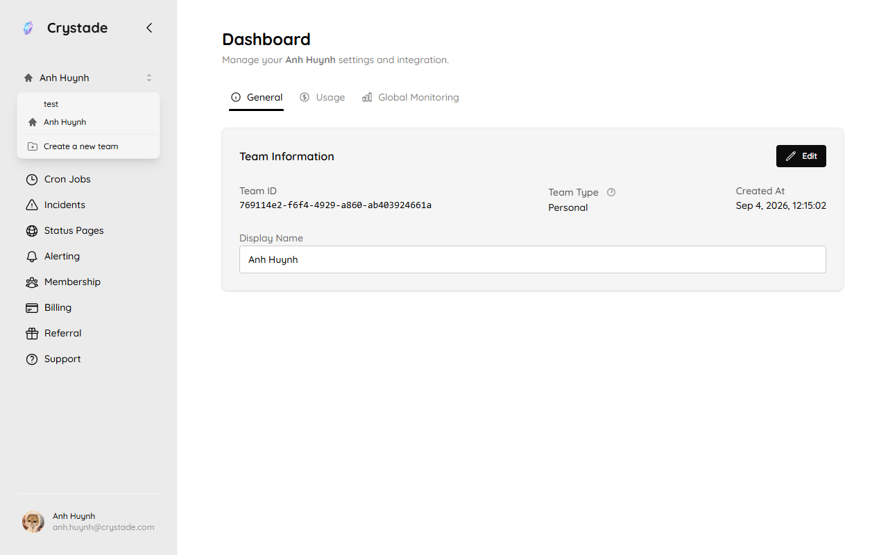
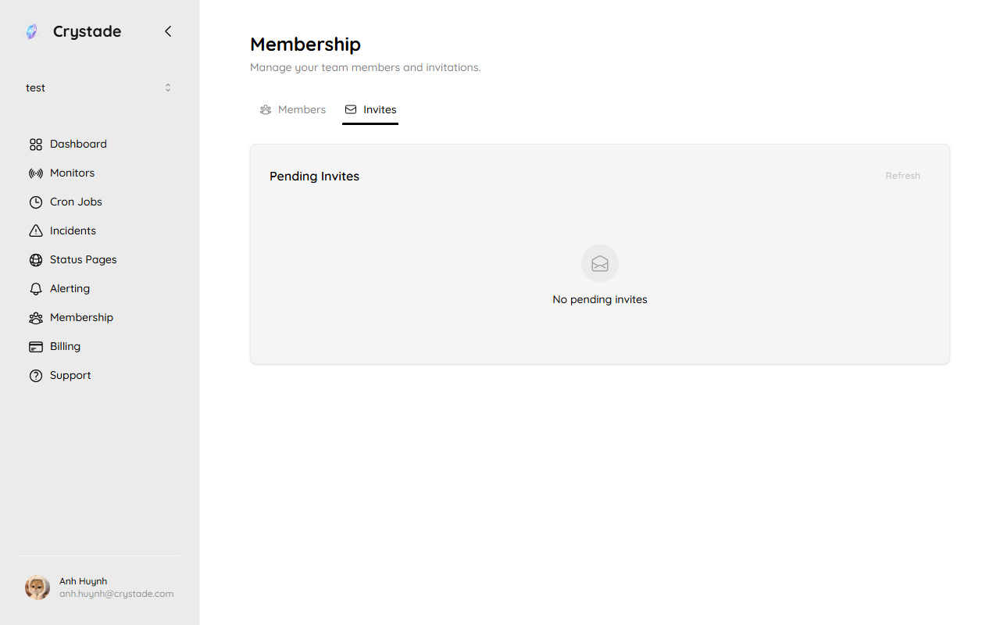
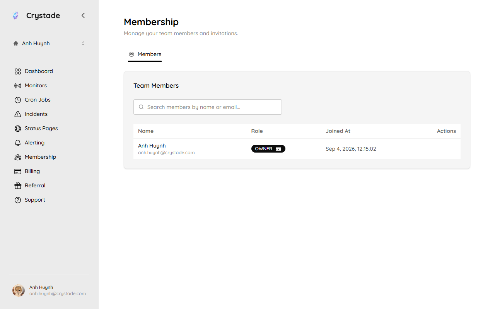

import { Aside, Card, CardGrid, LinkCard } from '@astrojs/starlight/components';

A team owns resources such as cron jobs, monitors, incidents, and status pages. Resources stay inside the team where they were created and cannot move to another team.

## Personal and collaborative teams

Crystade supports two team types:

| Team type | Use it for |
|-----------|------------|
| **Personal team** | Solo work, private experiments, and resources that only you manage. |
| **Collaborative team** | Shared production resources and work that multiple teammates manage together. |

Every account starts with a personal team. Membership on a personal team cannot be changed, and invitations are disabled. Create a collaborative team when you need shared access or team billing.

A team cannot be deleted. You can create at most 5 teams. You can join at most 30 teams that you did not create. There is no limit on how many members a collaborative team can have.

## Roles

Collaborative teams have two roles:

| Role | What they can do |
|------|------------------|
| **Owner** | Manage team settings, invite members, update roles, and remove members. |
| **Member** | View team membership and work with team resources according to product permissions. |

The person who created the team is the creator. The creator cannot be changed. You cannot leave a team if you are its creator. Owners can promote or demote anyone except themselves and the creator.

Owner seats depend on the team plan: Free allows 1 owner, Starter allows 2, and Standard allows unlimited owners. Member seats are unlimited on every plan.

### Access control

| Action | Member | Owner |
|--------|:------:|:-----:|
| List members | Yes | Yes |
| Invite a user | | Yes |
| Promote a member to owner | | Yes |
| Demote an owner to member | | Yes |
| Remove a member | | Yes |
| Leave the team (self) | Yes | Yes |
| Update team name and settings | | Yes |

The billing admin cannot leave, be removed, or be demoted until they transfer billing admin to another owner. See [Billing and plans](/guides/billing/).

## Invitations

Owners invite teammates by email. The invited user can accept or reject a non-expired invite. Any owner can revoke a non-expired invite. Invites expire after 24 hours.

There is no limit on how many invites an owner can send, or on how many invites a user can receive. Member invitation is disabled on personal teams. On a collaborative team, open **Membership** and use **Invite Member**. Pending invites appear on the **Invites** tab.

Use invitations when you want to:

- Add engineers to manage jobs and monitors
- Bring an operations teammate into the team
- Give a billing or team lead visibility into team activity

## Billing admin

Each team has exactly one billing admin. This person manages subscriptions, payment details, invoices, and billing changes for the team.

The billing admin must be an owner. The team creator is the initial billing admin. If billing responsibility changes, transfer the billing admin role to another owner before changing that user's access.

## Good practices

<CardGrid>
<Card title="Use teams by environment" icon="setting">
	Separate production and staging resources into different teams if they have different ownership or billing needs.
</Card>
<Card title="Keep ownership small" icon="people">
	Grant owner access only to teammates who need to manage team settings or members.
</Card>
<Card title="Review access regularly" icon="magnifier">
	Remove users who no longer need access to shared cron jobs or monitors.
</Card>
</CardGrid>

## FAQ

### Can I delete a team?

No. Teams are not removable. Delete unused resources instead, or leave a collaborative team if you are not the creator.

### Can I invite people to my personal team?

No. Member invitation is disabled on personal teams. **Membership** on a personal team shows only the **Members** tab.

Create a collaborative team when you need shared access.

### Can the team creator leave?

No. Anyone except the creator can leave a collaborative team. The creator also cannot be promoted, demoted, or replaced.

## Related

<CardGrid>
<LinkCard title="Billing and plans" href="/guides/billing/" description="Learn how team billing and plan management work." />
<LinkCard title="Resources" href="/guides/resources/" description="Understand how resources stay scoped to a team." />
<LinkCard title="Glossary" href="/reference/glossary/" description="Definitions for team, owner, member, and billing admin." />
</CardGrid>
