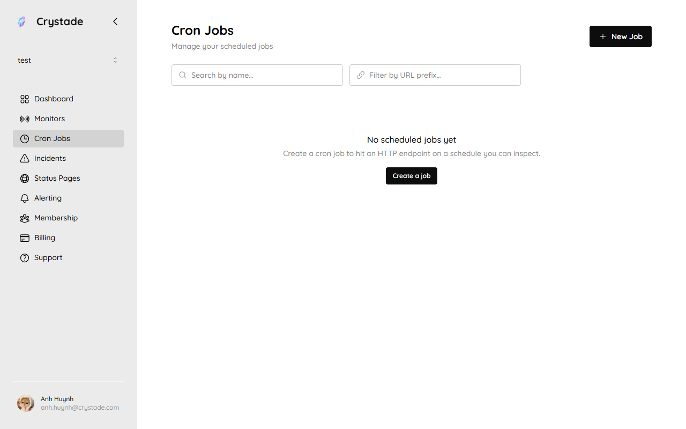
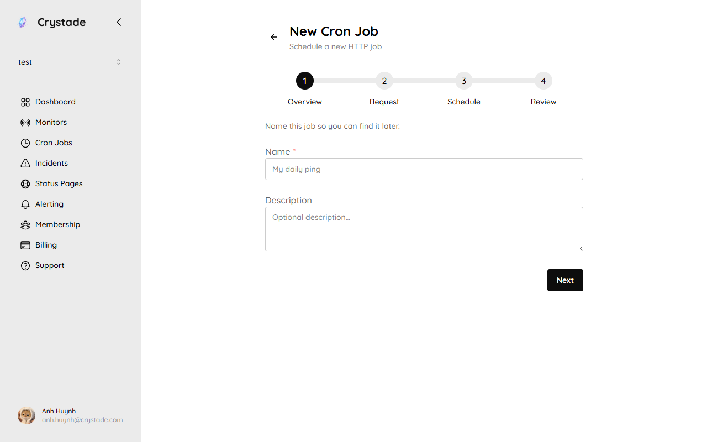

import { Steps, Aside, LinkCard, CardGrid } from '@astrojs/starlight/components';

This tutorial walks you through creating a scheduled HTTP cron job on your personal team and reading the first execution log. Expect about 10 minutes.

Onboarding uses this same path when your primary job is cron jobs. Crystade runs the new job immediately so you do not wait for the next schedule tick.

## Prerequisites

- A Crystade account signed in with Google or GitHub
- A public HTTP or HTTPS URL you are allowed to call
- Your personal team selected in the team switcher

## Step 1: Create the job

<Steps>

1. Open **Cron Jobs** on your personal team and choose **Create a job** (or **New Job**).

   

2. Name the job after the task, for example `Keep-alive ping`.

   

3. Set a Unix cron expression. On Free, the minimum interval is 5 minutes (for example `*/5 * * * *`). Starter and Standard allow 1 minute.

4. Set the URL, HTTP method (`GET`, `POST`, `PUT`, `PATCH`, or `DELETE`), optional headers (max 20), and optional text body (max 256 KB). Body formats are plain text, JSON, or XML.

5. Set connection timeout (max 15 minutes) and redirect-follow limit (max 10).

6. Save the job.

</Steps>

Private, loopback, and link-local URLs are rejected. A definition change takes effect within 5 minutes for scheduled runs. A manual trigger always uses the latest saved definition.

## Step 2: Run it once

<Steps>

1. From the job page, trigger a manual run. Manual trigger uses the latest definition even if the job is disabled.

2. On Free, manual triggers are limited to 50 per team per week. This first-win run counts toward that limit.

3. Wait on the page until an execution appears, or until the short wait limit is reached. If the wait times out, the job already exists and later scheduled runs still execute.

</Steps>

Disabled and [paused](/concepts/capacity/) jobs are not picked up by the scheduler. You can still trigger them manually when they are disabled.

## Step 3: Read the execution log

<Steps>

1. Open the execution from the job's history.

2. Confirm the request snapshot (method, URL, headers, body), response status, and timing: scheduled at, started at, completed at.

3. On Free, response body capture is 0 bytes. Starter captures up to 4 KB; Standard up to 16 KB. All executions are retained; how far back you can see them depends on the plan (30 / 90 / 365 days).

</Steps>

<Aside>
Retry is not available on Free. Starter and Standard retry a failed execution up to 10 attempts within 30 minutes. See the [cron job reference](/reference/cron-jobs/).
</Aside>

## Next steps

<CardGrid>
<LinkCard title="Create and run a cron job" href="/guides/cron-jobs/" description="Fields, schedules, and manual trigger." />
<LinkCard title="Billing and plans" href="/guides/billing/" description="Add cron job capacity without changing your base plan." />
<LinkCard title="Cron job reference" href="/reference/cron-jobs/" description="Limits, retries, log retention, and tracing headers." />
</CardGrid>
